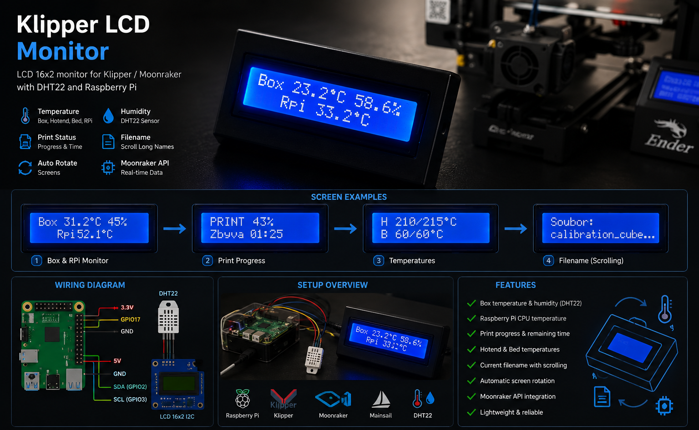

# Klipper LCD Monitor



Simple LCD 16x2 monitor for Klipper printers using Moonraker API, Raspberry Pi and a DHT22 sensor.

The display automatically rotates between enclosure information, printer status, temperatures and the currently printed file.

Designed for users who want a dedicated hardware monitor next to their 3D printer instead of constantly checking Mainsail.

---

## Features

* 🌡️ Enclosure temperature (DHT22)
* 💧 Enclosure humidity (DHT22)
* 🖥️ Raspberry Pi CPU temperature
* 🖨️ Printer state (PRINTING, PAUSED, COMPLETE, etc.)
* 📊 Print progress percentage
* ⏱️ Estimated remaining print time
* 🔥 Hotend temperature
* ♨️ Heated bed temperature
* 📄 Current G-code filename
* ↔️ Automatic scrolling for long filenames
* 🔄 Automatic screen rotation

---

## Example Screens

### Enclosure Monitor

```text
Box 23.2°C 58%
Rpi 33.2°C
```

### Print Progress

```text
PRINT 43%
Zbyva 01:25
```

### Temperatures

```text
H 210/215°C
B 60/60°C
```

### Filename

```text
Soubor:
calibration_cube...
```

---

## Hardware Requirements

* Raspberry Pi
* Klipper
* Moonraker
* Mainsail
* DHT22 Sensor
* LCD 16x2 with I2C backpack (PCF8574)

---

## Wiring

### DHT22

| DHT22 | Raspberry Pi |
| ----- | ------------ |
| VCC   | 3.3V         |
| DATA  | GPIO17       |
| GND   | GND          |

### LCD 16x2 I2C

| LCD | Raspberry Pi |
| --- | ------------ |
| VCC | 5V           |
| GND | GND          |
| SDA | GPIO2        |
| SCL | GPIO3        |

---

## Installation

Update system:

```bash
sudo apt update
```

Install required packages:

```bash
sudo apt install python3-pip python3-smbus i2c-tools
```

Install Python dependencies:

```bash
pip3 install requests RPLCD smbus2 Adafruit_DHT
```

---

## Verify LCD Address

Run:

```bash
i2cdetect -y 1
```

Common addresses:

```text
0x27
0x3F
```

Edit:

```python
LCD_I2C_ADDRESS = 0x27
```

if necessary.

---

## Running

```bash
python3 box_monitor.py
```

---

## Automatic Startup (systemd)

Copy the service file:

```bash
sudo cp systemd/box_monitor.service /etc/systemd/system/
```

Reload systemd:

```bash
sudo systemctl daemon-reload
```

Enable service:

```bash
sudo systemctl enable box_monitor
```

Start service:

```bash
sudo systemctl start box_monitor
```

Check status:

```bash
sudo systemctl status box_monitor
```

---

## Moonraker Objects Used

The script reads:

* print_stats
* display_status
* extruder
* heater_bed
* virtual_sdcard

---

## Troubleshooting

### LCD not responding

Error:

```text
OSError: [Errno 121] Remote I/O error
```

Check:

```bash
i2cdetect -y 1
```

Verify:

* I2C address
* SDA/SCL wiring
* Power supply
* LCD connection

---

## Gallery

### Real Hardware


---

## Future Ideas

* Rotary encoder support
* Physical buttons
* Pause / Resume control
* Buzzer notifications
* RGB status LEDs
* Fan control
* Multiple printer support
* Custom PCB

---

## License

MIT License
